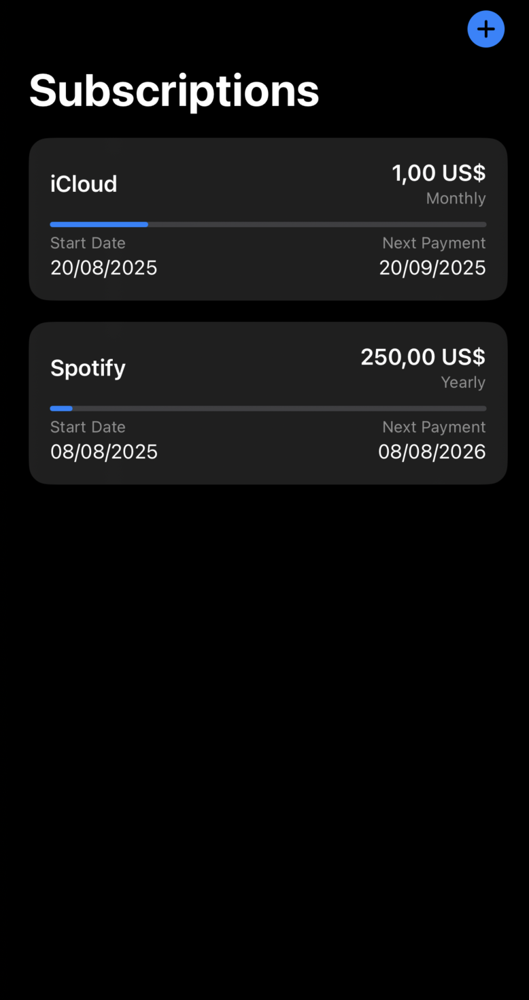

# Subscription Tracker

Subscription Tracker is a simple iOS app that helps you keep track of your subscriptions.

  

## Features

- Add, edit, and delete subscriptions.
- See a list of all your subscriptions, sorted by the next billing date.
- See the progress of the current billing cycle for each subscription.
- Get a notification a day before a subscription is due.

## Technologies Used

- SwiftUI
- SwiftData
- Local Notifications
- String Catalog for i18n
